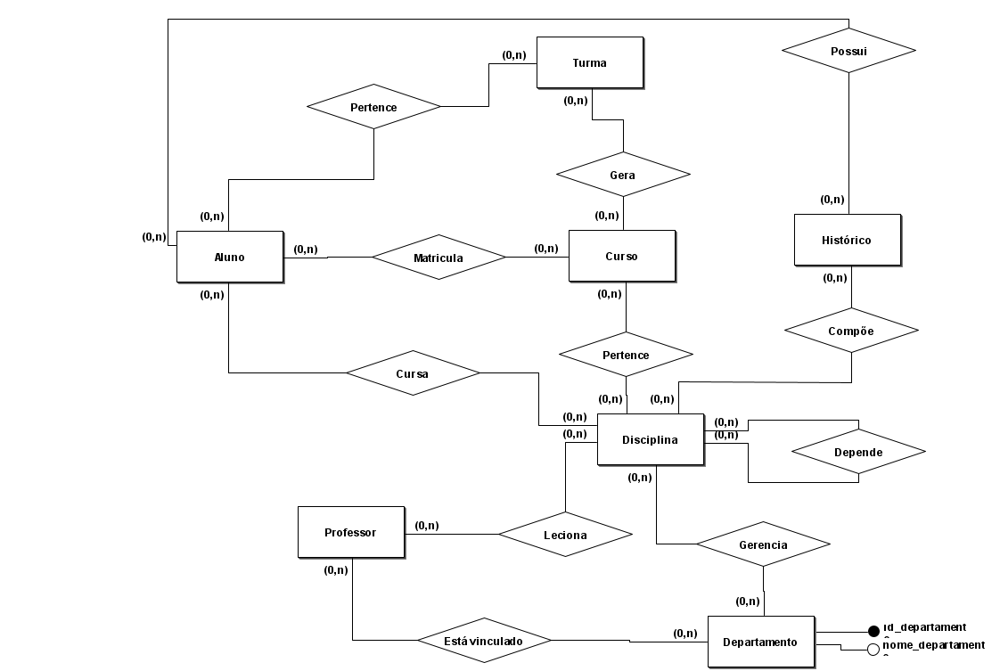
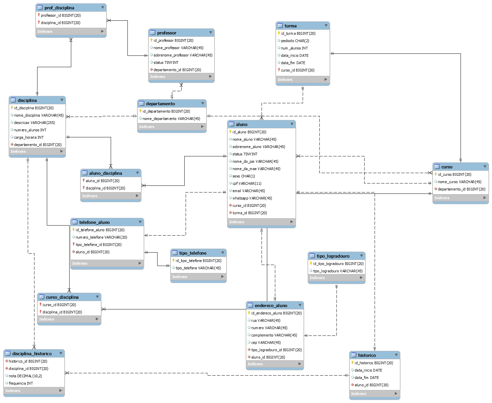

# Projeto de Banco de Dados para Faculdade

## Apresentação

Banco de Dados para gerenciamento de uma Faculdade.

## Objetivos do Banco:

Realizar o controle centralizado de alunos, professores, cursos, disciplinas, histórico escolar e turmas.

## Regras do Negócio

*	Um aluno só pode estar matriculado em um curso por vez.
*	Alunos possuem um código de identificação (RA).
*	Cursos são compostos por disciplinas.
*	Cada disciplina terá no máximo 30 alunos por turma.
*	As disciplinas podem ser obrigatórias ou optativas, dependendo do curso.
*	As disciplinas pertencem a departamentos específicos.
*	Cada disciplina possui um código de identificação.
*	Alunos podem trancar matrícula, não estando matriculados em nenhuma disciplina no semestre.
*	Em cada semestre, cada aluno pode se matricular em no máximo 9 disciplinas.
*	O aluno só pode ser reprovado no máximo três vezes na mesma disciplina.
*	A faculdade terá no máximo 3000 alunos matriculados simultaneamente, em 10 cursos distintos.
*	Entram 300 alunos novos por ano.
*	Existem 90 disciplinas no total, disponíveis.
*	Um Histórico Escolar traz todas as disciplinas cursadas por um aluno, incluindo nota final, frequência e período do curso realizado.
*	Professores podem ser cadastrados mesmo sem lecionar disciplinas.
*	Existem 40 professores trabalhando na escola.
*	Cada professor irá lecionar no máximo  4 disciplinas diferentes.
*	Cada professor é vinculado a um departamento.
*	Professores são identificados por um código de professor.
*	Algumas disciplinas dependem da conclusão de outras disciplinas para serem cursadas

## Modelo Conceitual

## Modelo Lógico

